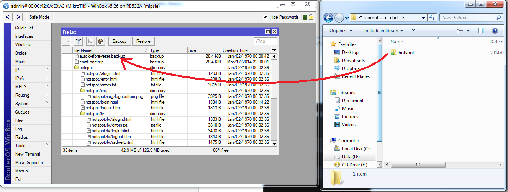

## To install the template on your hotspot:

**1.** Connect to your Mikrotik router using winbox
**2.** Open the "files" window
**3.** Drag the "hotspot" folder from the zip file onto the root of your router's file system

